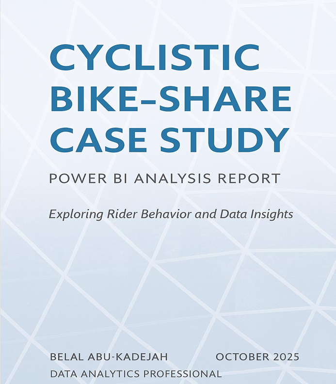
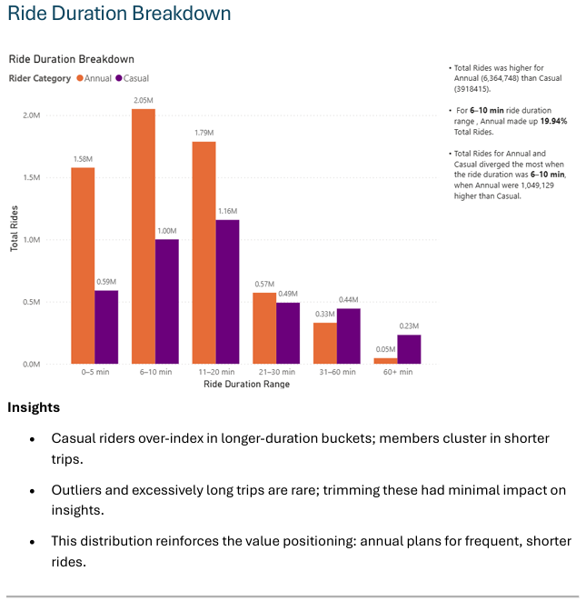
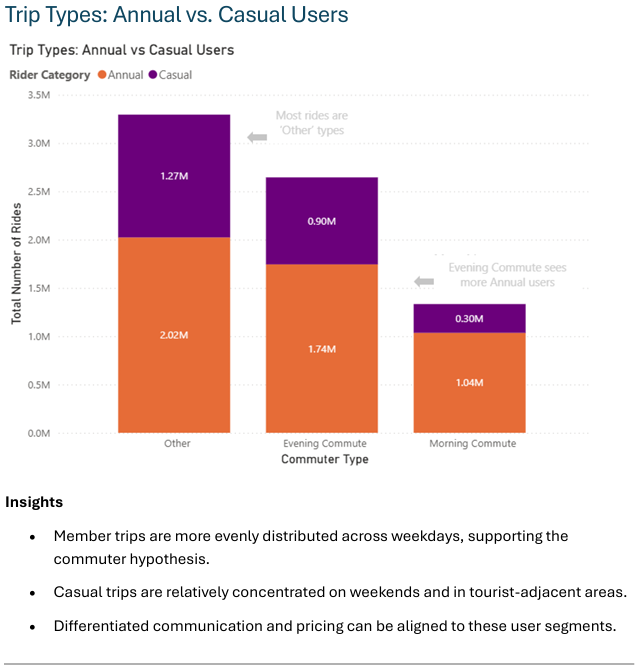
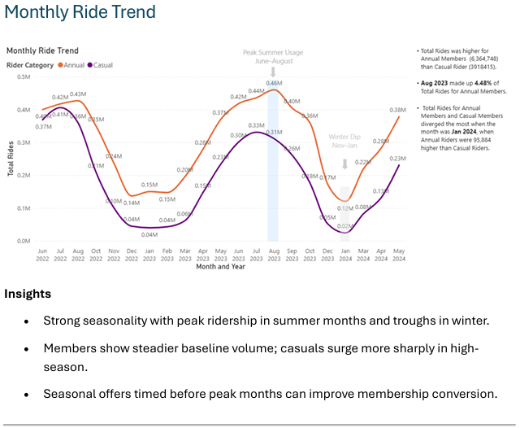
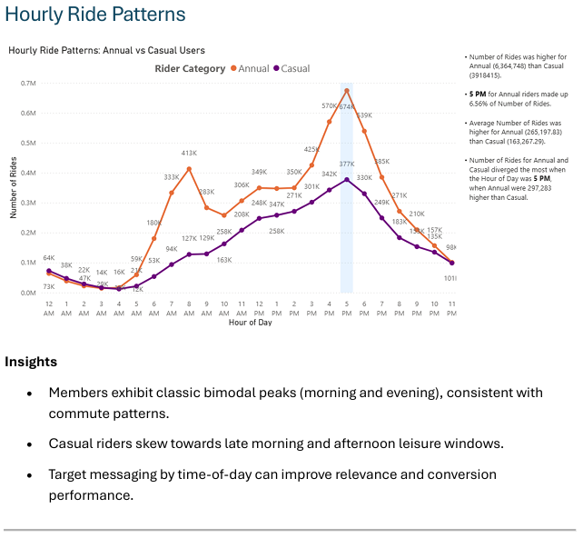
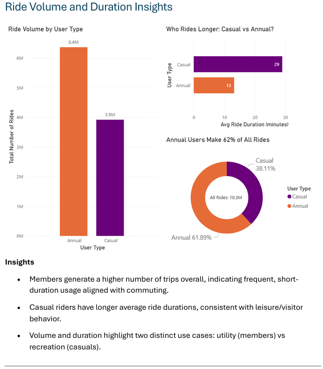

# Cyclistic Bike-Share Case Study

## Project Overview

This project is an end-to-end bike-share analysis focused on understanding how casual riders differ from annual members and identifying actions that can help increase membership conversions.

The analysis covers 12 months of Cyclistic trip data and combines data cleaning, modeling, business analysis, and dashboard storytelling.

## Business Question

How do casual riders and annual members use Cyclistic bikes differently, and what actions can help convert casual riders into members?

## Tools Used

- Google BigQuery
- Python (pandas)
- Power BI

## Executive Summary

This analysis found clear behavioral differences between casual riders and annual members:

- Members ride more frequently and tend to take shorter trips
- Casual riders take longer rides and are more concentrated on weekends
- Member usage is more aligned with weekday commuting patterns
- Casual usage is more seasonal, especially during summer

These patterns suggest strong opportunities for targeted conversion campaigns, commuter-focused bundles, and seasonal promotions.

## Key Insights

### Ride Volume and Duration
- Members generate a higher number of trips overall
- Casual riders have longer average ride durations
- The data reflects two main use cases: commuting vs. recreation

### Trip Types
- Member rides are more evenly distributed across weekdays
- Casual riders are more concentrated around weekends and leisure-related patterns

### Monthly Trends
- Ridership peaks in summer and drops in winter
- Casual ridership shows stronger seasonality than member ridership

### Hourly Ride Patterns
- Members show commuting peaks in morning and evening hours
- Casual riders are more active in late morning and afternoon periods

### Ride Duration Breakdown
- Casual riders are overrepresented in longer ride duration buckets
- Members are concentrated in shorter rides

## Recommendations

1. Launch weekend-to-membership promotions for frequent casual weekend riders
2. Offer commuter-focused annual bundles and value messaging
3. Start seasonal acquisition campaigns before summer peak months
4. Use behavioral nudges after repeated casual rides to encourage upgrades
5. Target high-casual stations with localized promotional messaging

## Project Files

- Cyclistic_Bike-Share_Case_Study_Belal_Abu-Kadejah.pdf

## Dashboard Preview

### Cover Page

### Ride Volume and Duration Insights

### Trip Types: Annual vs. Casual Users

### Monthly Ride Trend

### Hourly Ride Patterns

### Ride Duration Breakdown

## Conclusion

This project demonstrates a full analytics workflow from data ingestion and cleaning to business analysis and dashboard development. The final recommendations are designed to support membership conversion and long-term customer value.

## Author

**Belal Abu-Kadejah**  
Senior Business & Product Analyst | Data Analytics | Power BI | SQL
